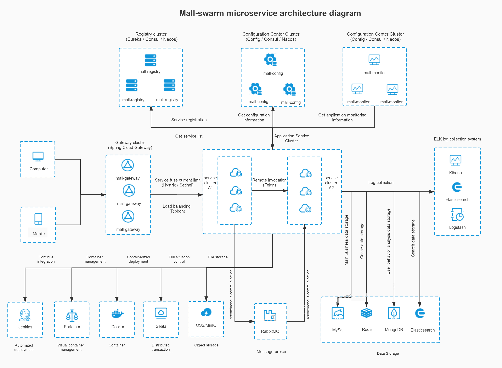

# mall

<p>
<<<<<<< HEAD
    <a href="#Public Number"></a><a href="https://github.com/macrozheng/mall-learning"></a>
    <a href="https://github.com/macrozheng/mall-admin-web"></a> <a href="http://qm.qq.com/cgi-bin/qm/qr?k=V6xu5c12j9qhnMUNdDRzakNxRKzOxibQ"></a>
    <A href="http://qm.qq.com/cgi-bin/qm/qr?k=M5Edq2TiJL_ShcOEeYjwcmdGmq4zZrd_"></a>
    <a href="https://gitee.com/macrozheng/mall"></a></p>
=======
  <a href="#公众号"></a>
  <a href="https://github.com/macrozheng/mall-learning"></a>
  <a href="https://github.com/macrozheng/mall-swarm"></a>
  <a href="https://github.com/macrozheng/mall-admin-web"></a>
  <a href="http://qm.qq.com/cgi-bin/qm/qr?k=V6xu5c12j9qhnMUNdDRzakNxRKzOxibQ"></a>
  <a href="#公众号"></a>
  <a href="https://gitee.com/macrozheng/mall"></a>
</p>
>>>>>>> 7e420f19689f24fbd05f2452fed85dc991ea73b7

## Foreword

`mall`The project is dedicated to building a complete e-commerce system, using the current popular technology to achieve。

## Project documentation

<<<<<<< HEAD
- Document address：[https://macrozheng.github.io/mall-learning](https://macrozheng.github.io/mall-learning)
- Alternate address：[https://macrozheng.gitee.io/mall-learning](https://macrozheng.gitee.io/mall-learning)
=======
- 文档地址：[http://www.macrozheng.com](http://www.macrozheng.com)
- 备用地址：[https://macrozheng.github.io/mall-learning](https://macrozheng.github.io/mall-learning)
>>>>>>> 7e420f19689f24fbd05f2452fed85dc991ea73b7

## Project Introduction

<<<<<<< HEAD
`mall`The project is an e-commerce system, including the front-end mall system and the back-end management system, based on SpringBoot+MyBatis. The front-end mall system includes home portal, product recommendation, product search, product display, shopping cart, order process, member center, customer service, help center and other modules. The background management system includes modules such as commodity management, order management, member management, promotion management, operation management, content management, statistical reporting, financial management, authority management, and setting.
### Project demonstration
=======
`mall`项目是一套电商系统，包括前台商城系统及后台管理系统，基于SpringBoot+MyBatis实现，采用Docker容器化部署。前台商城系统包含首页门户、商品推荐、商品搜索、商品展示、购物车、订单流程、会员中心、客户服务、帮助中心等模块。后台管理系统包含商品管理、订单管理、会员管理、促销管理、运营管理、内容管理、统计报表、财务管理、权限管理、设置等模块。
>>>>>>> 7e420f19689f24fbd05f2452fed85dc991ea73b7

#### Background management system

Front-end project `mall-admin-web` address：https://github.com/macrozheng/mall-admin-web

<<<<<<< HEAD
Project demo address： [http://39.98.190.128/index.html](http://39.98.190.128/index.html)  
=======
前端项目`mall-admin-web`地址：https://github.com/macrozheng/mall-admin-web

项目演示地址： [http://www.macrozheng.com/admin/index.html](http://www.macrozheng.com/admin/index.html)  
>>>>>>> 7e420f19689f24fbd05f2452fed85dc991ea73b7


#### Front office system

Front-end project `mall-app-web` address: Stay tuned...

<<<<<<< HEAD
Project demo address：[http://39.98.190.128/mall-app/mainpage.html](http://39.98.190.128/mall-app/mainpage.html)
=======
项目演示地址：[http://www.macrozheng.com/app/index.html](http://www.macrozheng.com/app/index.html)
>>>>>>> 7e420f19689f24fbd05f2452fed85dc991ea73b7


### Organizational structure

``` lua
mall
<<<<<<< HEAD
├── mall-common -- Tool class and general code
├── mall-mbg -- Database operation code generated by MyBatisGenerator
├── mall-admin -- Backstage mall management system interface
├── mall-search -- Elasticsearch-based product search system
├── mall-portal -- Elasticsearch-based product search system...
└── mall-demo -- Test code when the framework is built
=======
├── mall-common -- 工具类及通用代码
├── mall-mbg -- MyBatisGenerator生成的数据库操作代码
├── mall-security -- SpringSecurity封装公用模块
├── mall-admin -- 后台商城管理系统接口
├── mall-search -- 基于Elasticsearch的商品搜索系统
├── mall-portal -- 前台商城系统接口
└── mall-demo -- 框架搭建时的测试代码
>>>>>>> 7e420f19689f24fbd05f2452fed85dc991ea73b7
```

### Technical selection

#### Backend technology

<<<<<<< HEAD
| technology           | Description         | Official website                                                         |
| -------------------- | ------------------- | ------------------------------------------------------------ |
| SpringBoot           | Container + MVC framework        | [https://spring.io/projects/spring-boot](https://spring.io/projects/spring-boot) |
| SpringSecurity       | Certification and authorization framework      | [https://spring.io/projects/spring-security](https://spring.io/projects/spring-security) |
| MyBatis              | ORM framework             | [http://www.mybatis.org/mybatis-3/zh/index.html](http://www.mybatis.org/mybatis-3/zh/index.html) |
| MyBatisGenerator     | Data layer code generation      | [http://www.mybatis.org/generator/index.html](http://www.mybatis.org/generator/index.html) |
| PageHelper           | MyBatis physical paging plugin | [http://git.oschina.net/free/Mybatis_PageHelper](http://git.oschina.net/free/Mybatis_PageHelper) |
| Swagger-UI           | Document production tool        | [https://github.com/swagger-api/swagger-ui](https://github.com/swagger-api/swagger-ui) |
| Hibernator-Validator | Verification framework            | [http://hibernate.org/validator/](http://hibernate.org/validator/) |
| Elasticsearch        | search engine            | [https://github.com/elastic/elasticsearch](https://github.com/elastic/elasticsearch) |
| RabbitMq             | message queue            | [https://www.rabbitmq.com/](https://www.rabbitmq.com/)       |
| Redis                | Distributed cache          | [https://redis.io/](https://redis.io/)                       |
| MongoDb              | NoSql database         | [https://www.mongodb.com/](https://www.mongodb.com/)         |
| Docker               | Application container engine        | [https://www.docker.com/](https://www.docker.com/)           |
| Druid                | Database connection pool        | [https://github.com/alibaba/druid](https://github.com/alibaba/druid) |
| OSS                  | Object storage            | [https://github.com/aliyun/aliyun-oss-java-sdk](https://github.com/aliyun/aliyun-oss-java-sdk) |
| JWT                  | JWT login support         | [https://github.com/jwtk/jjwt](https://github.com/jwtk/jjwt) |
| LogStash             | Log collection tool        | [https://github.com/logstash/logstash-logback-encoder](https://github.com/logstash/logstash-logback-encoder) |
| Lombok               | Simplified object packaging tool    | [https://github.com/rzwitserloot/lombok](https://github.com/rzwitserloot/lombok) |

#### Front-end technology

| technology | Description           | Official website                                                         |
| ---------- | --------------------- | ------------------------------------------------------------ |
| Vue        | Front frame              | [https://vuejs.org/](https://vuejs.org/)                     |
| Vue-router | Routing framework              | [https://router.vuejs.org/](https://router.vuejs.org/)       |
| Vuex       | Global state management framework      | [https://vuex.vuejs.org/](https://vuex.vuejs.org/)           |
| Element    | Front-end UI framework            | [https://element.eleme.io/](https://element.eleme.io/)       |
| Axios      | Front-end HTTP framework          | [https://github.com/axios/axios](https://github.com/axios/axios) |
| v-charts   | Chart frame based on Echarts | [https://v-charts.js.org/](https://v-charts.js.org/)         |
| Js-cookie  | Cookie management tool        | [https://github.com/js-cookie/js-cookie](https://github.com/js-cookie/js-cookie) |
| nprogress  | Progress bar control            | [https://github.com/rstacruz/nprogress](https://github.com/rstacruz/nprogress) |
=======
| 技术                 | 说明                | 官网                                                 |
| -------------------- | ------------------- | ---------------------------------------------------- |
| SpringBoot           | 容器+MVC框架        | https://spring.io/projects/spring-boot               |
| SpringSecurity       | 认证和授权框架      | https://spring.io/projects/spring-security           |
| MyBatis              | ORM框架             | http://www.mybatis.org/mybatis-3/zh/index.html       |
| MyBatisGenerator     | 数据层代码生成      | http://www.mybatis.org/generator/index.html          |
| PageHelper           | MyBatis物理分页插件 | http://git.oschina.net/free/Mybatis_PageHelper       |
| Swagger-UI           | 文档生产工具        | https://github.com/swagger-api/swagger-ui            |
| Hibernator-Validator | 验证框架            | http://hibernate.org/validator                       |
| Elasticsearch        | 搜索引擎            | https://github.com/elastic/elasticsearch             |
| RabbitMq             | 消息队列            | https://www.rabbitmq.com/                            |
| Redis                | 分布式缓存          | https://redis.io/                                    |
| MongoDb              | NoSql数据库         | https://www.mongodb.com                              |
| Docker               | 应用容器引擎        | https://www.docker.com                               |
| Druid                | 数据库连接池        | https://github.com/alibaba/druid                     |
| OSS                  | 对象存储            | https://github.com/aliyun/aliyun-oss-java-sdk        |
| MinIO                | 对象存储            | https://github.com/minio/minio                       |
| JWT                  | JWT登录支持         | https://github.com/jwtk/jjwt                         |
| LogStash             | 日志收集工具        | https://github.com/logstash/logstash-logback-encoder |
| Lombok               | 简化对象封装工具    | https://github.com/rzwitserloot/lombok               |
| Jenkins              | 自动化部署工具      | https://github.com/jenkinsci/jenkins                 |

#### 前端技术

| 技术       | 说明                  | 官网                                   |
| ---------- | --------------------- | -------------------------------------- |
| Vue        | 前端框架              | https://vuejs.org/                     |
| Vue-router | 路由框架              | https://router.vuejs.org/              |
| Vuex       | 全局状态管理框架      | https://vuex.vuejs.org/                |
| Element    | 前端UI框架            | https://element.eleme.io               |
| Axios      | 前端HTTP框架          | https://github.com/axios/axios         |
| v-charts   | 基于Echarts的图表框架 | https://v-charts.js.org/               |
| Js-cookie  | cookie管理工具        | https://github.com/js-cookie/js-cookie |
| nprogress  | 进度条控件            | https://github.com/rstacruz/nprogress  |
>>>>>>> 7e420f19689f24fbd05f2452fed85dc991ea73b7

#### Architecture diagram

##### System architecture diagram

<<<<<<< HEAD

=======

>>>>>>> 7e420f19689f24fbd05f2452fed85dc991ea73b7

##### Business architecture diagram


#### Module introduction

##### Background management system `mall-admin`

- Commodity management：[功能结构图-商品.jpg](document/resource/mind_product.jpg)
- Order management：[功能结构图-订单.jpg](document/resource/mind_order.jpg)
- Promotion management：[功能结构图-促销.jpg](document/resource/mind_sale.jpg)
- Content management：[功能结构图-内容.jpg](document/resource/mind_content.jpg)
- User Management：[功能结构图-用户.jpg](document/resource/mind_member.jpg)

##### Front office system `mall-portal`

[功能结构图-前台.jpg](document/resource/mind_portal.jpg)

#### Development progress


## Environmental construction

### development tools

| tool          | Description         | Official website                                            |
| ------------- | ------------------- | ----------------------------------------------- |
<<<<<<< .merge_file_PVNtwc
| IDEA          | 开发IDE             | https://www.jetbrains.com/idea/download         |
| RedisDesktop  | redis客户端连接工具 | https://redisdesktop.com/download               |
| Robomongo     | mongo客户端连接工具 | https://robomongo.org/download                  |
| SwitchHosts   | 本地host管理        | https://oldj.github.io/SwitchHosts/             |
| X-shell       | Linux远程连接工具   | http://www.netsarang.com/download/software.html |
| Navicat       | 数据库连接工具      | http://www.formysql.com/xiazai.html             |
| PowerDesigner | 数据库设计工具      | http://powerdesigner.de/                        |
| Axure         | 原型设计工具        | https://www.axure.com/                          |
| MindMaster    | 思维导图设计工具    | http://www.edrawsoft.cn/mindmaster              |
| ScreenToGif   | gif录制工具         | https://www.screentogif.com/                    |
| ProcessOn     | 流程图绘制工具      | https://www.processon.com/                      |
| PicPick       | 图片处理工具        | https://picpick.app/zh/                         |
| Snipaste      | 屏幕截图工具        | https://www.snipaste.com/                       |
| Postman       | API接口调试工具      | https://www.postman.com/                        |
| Typora        | Markdown编辑器      | https://typora.io/                              |

### 开发环境

| 工具          | 版本号 | 下载                                                         |
=======
| IDEA          | Development IDE             | https://www.jetbrains.com/idea/download         |
| RedisDesktop  | Redis client connection tool | https://redisdesktop.com/download               |
| Robomongo     | Mongo client connection tool | https://robomongo.org/download                  |
| SwitchHosts   | Local host management        | https://oldj.github.io/SwitchHosts/             |
| X-shell       | Linux remote connection tool   | http://www.netsarang.com/download/software.html |
| Navicat       | Database connection tool      | http://www.formysql.com/xiazai.html             |
| PowerDesigner | Database design tool      | http://powerdesigner.de/                        |
| Axure         | Prototyping tool        | https://www.axure.com/                          |
| MindMaster    | Mind map design tool    | http://www.edrawsoft.cn/mindmaster              |
| ScreenToGif   | Gif recording tool         | https://www.screentogif.com/                    |
| ProcessOn     | Flow chart drawing tool      | https://www.processon.com/                      |
| PicPick       | Image processing tool        | https://picpick.app/zh/                         |
| Snipaste      | Screenshot tool        | https://www.snipaste.com/                       |

### Development environment

| tool          | version number | download                                                         |
>>>>>>> .merge_file_uMZEjh
| ------------- | ------ | ------------------------------------------------------------ |
| JDK           | 1.8    | https://www.oracle.com/technetwork/java/javase/downloads/jdk8-downloads-2133151.html |
| Mysql         | 5.7    | https://www.mysql.com/                                       |
| Redis         | 3.2    | https://redis.io/download                                    |
| Elasticsearch | 6.2.2  | https://www.elastic.co/downloads                             |
| MongoDb       | 3.2    | https://www.mongodb.com/download-center                      |
| RabbitMq      | 3.7.14 | http://www.rabbitmq.com/download.html                        |
| Nginx         | 1.10   | http://nginx.org/en/download.html                            |

<<<<<<< HEAD
### Construction steps

> Windows environment deployment

- Please refer to the Windows environment to build：[mall在Windows环境下的部署](https://github.com/macrozheng/mall-learning/blob/master/docs/deploy/mall_deploy_windows.md);
- Note: only start mall-admin, just install mysql;
- clone`mall-admin-web`project，And import into IDEA to complete the compilation[传送门](https://github.com/macrozheng/mall-admin-web);
- `mall-admin-web`Please refer to the installation and deployment of the project.：[mall前端项目的安装与部署](https://github.com/macrozheng/mall-learning/blob/master/docs/deploy/mall_deploy_web.md);
- Please refer to the construction of ELK log collection system.：[SpringBoot应用整合ELK实现日志收集](https://github.com/macrozheng/mall-learning/blob/master/docs/technology/mall_tiny_elk.md)。

> Docker environment deployment

- Install CenterOs7.6 in VirtualBox or other environments;
- Please refer to the installation of Docker environment.：[开发者必备Docker命令](https://github.com/macrozheng/mall-learning/blob/master/docs/reference/docker.md)；
- Please refer to the Docker image build of this project.：[使用Maven插件为SpringBoot应用构建Docker镜像](https://github.com/macrozheng/mall-learning/blob/master/docs/reference/docker_maven.md)；
- Please refer to the deployment of this project under the Docker container.：[mall在Linux环境下的部署（基于Docker容器）](https://github.com/macrozheng/mall-learning/blob/master/docs/deploy/mall_deploy_docker.md)；
- Please refer to Docker Compose for this project.： [mall在Linux环境下的部署（基于Docker Compose）](https://github.com/macrozheng/mall-learning/blob/master/docs/deploy/mall_deploy_docker_compose.md)。

## Reference material

- [Spring combat（4th edition）](https://book.douban.com/subject/26767354/)
- [Spring Boot combat](https://book.douban.com/subject/26857423/)
- [Spring Cloud micro service actual combat](https://book.douban.com/subject/27025912/)
- [Spring Cloud and Docker microservice architecture combat](https://book.douban.com/subject/27028228/)
- [Spring Data combat](https://book.douban.com/subject/25975186/)
- [MyBatis from entry to mastery](https://book.douban.com/subject/27074809/)
- [Dive into MySQL](https://book.douban.com/subject/25817684/)
- [Step-by-step Linux（Version 2）](https://book.douban.com/subject/26758194/)
- [Elasticsearch Authoritative guide](https://www.elastic.co/guide/cn/elasticsearch/guide/current/index.html)
- [Elasticsearch Technical analysis and actual combat](https://book.douban.com/subject/26967826/)
- [MongoDB combat(second edition)](https://book.douban.com/subject/27061123/)
- [Kubernetes authoritative guide](https://book.douban.com/subject/26902153/)
- [Pro Git](https://git-scm.com/book/zh/v2)
=======
### 搭建步骤

> Windows环境部署

- Windows环境搭建请参考：[mall在Windows环境下的部署](http://www.macrozheng.com/#/deploy/mall_deploy_windows);
- 注意：只启动mall-admin,仅需安装mysql即可;
- 克隆`mall-admin-web`项目，并导入到IDEA中完成编译：[前端项目地址](https://github.com/macrozheng/mall-admin-web);
- `mall-admin-web`项目的安装及部署请参考：[mall前端项目的安装与部署](http://www.macrozheng.com/#/deploy/mall_deploy_web);
- ELK日志收集系统的搭建请参考：[SpringBoot应用整合ELK实现日志收集](http://www.macrozheng.com/#/technology/mall_tiny_elk);
- 使用MinIO存储文件请参考：[前后端分离项目，如何优雅实现文件存储](http://www.macrozheng.com/#/technology/minio_use);
- 读写分离解决方案请参考：[你还在代码里做读写分离么，试试这个中间件吧](http://www.macrozheng.com/#/reference/gaea)。

> Docker环境部署

- 使用虚拟机安装CentOS7.6请参考：[虚拟机安装及使用Linux，看这一篇就够了](http://www.macrozheng.com/#/reference/linux_install);
- Docker环境的安装请参考：[开发者必备Docker命令](http://www.macrozheng.com/#/reference/docker);
- 本项目Docker镜像构建请参考：[使用Maven插件为SpringBoot应用构建Docker镜像](http://www.macrozheng.com/#/reference/docker_maven);
- 本项目在Docker容器下的部署请参考：[mall在Linux环境下的部署（基于Docker容器）](http://www.macrozheng.com/#/deploy/mall_deploy_docker);
- 本项目使用Docker Compose请参考： [mall在Linux环境下的部署（基于Docker Compose）](http://www.macrozheng.com/#/deploy/mall_deploy_docker_compose);
- 本项目在Linux下的自动化部署请参考：[mall在Linux环境下的自动化部署（基于Jenkins）](http://www.macrozheng.com/#/deploy/mall_deploy_jenkins)。
>>>>>>> 7e420f19689f24fbd05f2452fed85dc991ea73b7

## No public

<<<<<<< HEAD
Mall project full set of tutorials serial，**Concerned about the public number**Get it in the first place。
=======
mall项目全套学习教程连载中，关注公众号「**macrozheng**」第一时间获取。

加微信群交流，公众号后台回复「**加群**」即可。
>>>>>>> 7e420f19689f24fbd05f2452fed85dc991ea73b7


## license

[Apache License 2.0](https://github.com/macrozheng/mall/blob/master/LICENSE)

Copyright (c) 2018-2020 macrozheng
